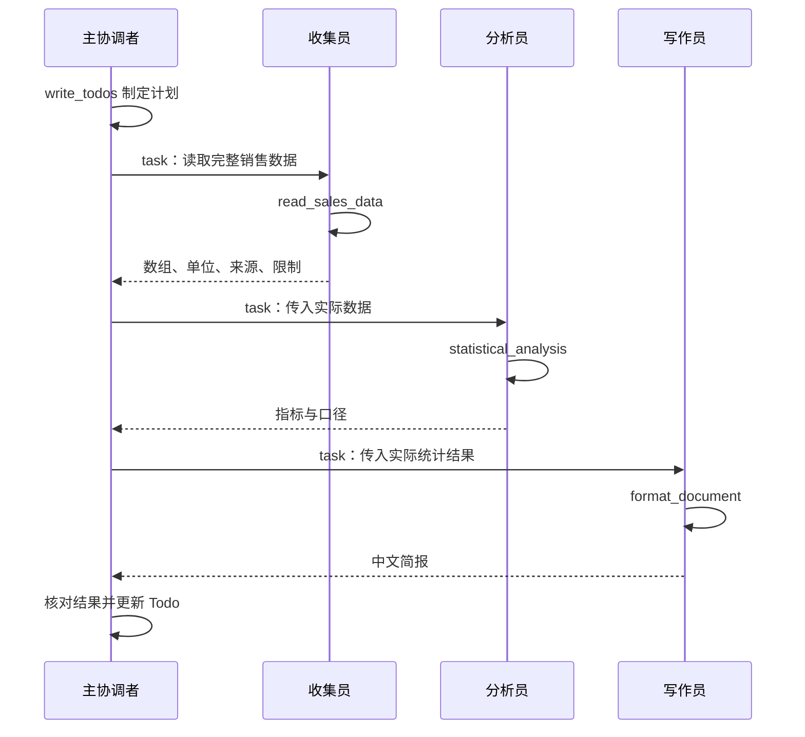

# 第五章：子 Agent 与上下文隔离——让 Agent 学会委派

本笔记整理第五章的概念、角色设计、多 Agent 协作示例、运行记录和排错方法。代码由 Codex 辅助整理，数据为虚构教学数据；离线验证采用固定响应模型，不代表真实模型已自主完成协作，也不代表学习者已独立掌握。

## 1. 子 Agent 解决什么问题

复杂任务常包含搜索、阅读、计算和写作。如果所有工具输出都进入主 Agent 的消息历史，主 Agent 就要反复处理大量细节。子 Agent 将某一项工作放入独立上下文，主 Agent 负责分解任务、选择角色、传递输入、检查返回结果和整合答案。

默认隔离模式下，可以将一次委派理解为：主 Agent 发出任务说明 → 子 Agent 在自己的消息上下文中调用模型和工具 → 最终结果返回主 Agent。它不是另一个直接与用户对话的角色，也不意味着启动独立操作系统进程。

上下文隔离不是整个系统状态与权限的完全隔离。文件、backend、部分状态和外部资源是否共享，需要按配置判断。子 Agent 也会消耗模型调用和 token；主上下文变小不保证总成本更低。

适用：多步骤研究、专业分析、需要不同工具或指令的工作。不必把每次简单计算都包装为子 Agent；确定性计算直接使用 Python 工具即可。

## 2. 配置字段与各自职责

| 字段 | 作用 | 设计要点 |
|---|---|---|
| `name` | 唯一角色标识 | 调用目标必须与注册名称一致 |
| `description` | 给主 Agent 的选择依据 | 写清适用场景、输入和交付物 |
| `system_prompt` | 给子 Agent 的执行指令 | 写清工具、结果格式、失败与停止条件 |
| `tools` | 配置业务工具 | 显式指定替换继承的业务工具；不等于排除所有框架内置工具 |
| `model` | 角色使用的模型 | 可省略以使用主模型，先保证流程稳定再优化成本 |
| `middleware` | 子 Agent 的附加运行行为 | 不假定专业子 Agent 自动继承主 Agent 的 Todo |
| `skills` | 专业技能来源 | 专业角色按需显式指定，并保证 backend 中路径可读 |
| `response_format` | 结构化输出 schema | 约束结构，不能证明内容真实 |

`description` 有两种位置：角色配置中的描述是长期职责；`task` 参数中的描述是这一次委派的实际输入。实际工具参数采用 `subagent_type` 和 `description`，课程中的 `task(name=..., task=...)` 只作流程示意，不应直接当作当前 SDK 的调用签名。

## 3. 默认通用子 Agent 与自定义图

### general-purpose

默认通用子 Agent 让应用无需编写专业角色也能委派；`subagents=[]` 不应直接理解为禁用全部委派。在本章核对的 `deepagents==0.7.13` 中，不应照搬教材中“通用子 Agent 自动继承主 system_prompt 和显式 Todo”的说法：它有自己的提示词，主 Agent 的 Todo 不自动成为它的 Todo。

如需关闭默认通用子 Agent，可通过匹配模型的 Harness Profile 配置 `GeneralPurposeSubagentProfile(enabled=False)`；如仍注册专业角色，专业角色的委派仍然存在。不要用排除 `SubAgentMiddleware` 的方式代替受支持的开关。本示例保留默认机制，只通过主提示词引导使用三个专业角色，不宣称做了硬权限封锁。

### CompiledSubAgent

字典配置适合一般角色；已有 LangGraph 图或需要显式分支、循环时，可以将编译后的图放入 `CompiledSubAgent` 的 `runnable`。图的状态需要包含 `messages`，结果要满足主子交接协议。

```python
# 结构示意：custom_graph 是应用已构建好的编译图。
data_agent = CompiledSubAgent(
    name="data-analyzer",
    description="按固定分析工作流处理数据并返回结论",
    runnable=custom_graph,
)
```

`create_agent(...)` 已返回可运行的编译图；手工构造 `StateGraph` 时再调用 `.compile()`。把图包装为子 Agent 不会自动补齐该图未配置的所有 Deep Agents 功能。

## 4. 多 Agent 协作示例：销售数据简报

[完整可运行代码](../examples/ch05-subagents/multi_agent_example.py) · [安装及 PyCharm 运行说明](../examples/ch05-subagents/README.md)

业务目标：读取六个月虚构销售额，计算总额、均值、最高最低月份和首末月变化，生成中文 Markdown 简报。

### 角色设计

| 角色 | 输入 | 业务工具 | 交付物 | 边界 |
|---|---|---|---|---|
| 主协调者 | 用户问题及各阶段返回值 | `task`、显式启用的 `write_todos` | 最终报告 | 负责交接与核对，不把 Todo 当完成证明 |
| data-collector | 读取数据的任务 | `read_sales_data` | 月份、销售额、单位、来源、限制 | 不计算指标，不省略六条必要数据 |
| data-analyzer | 完整数据与口径 | `statistical_analysis` | 全部指标及来源、限制 | 不猜数据，不把首末变化叫同比 |
| report-writer | 指标、单位、来源、限制 | `format_document` | Markdown 报告 | 不补造利润、增长原因或来源 |

### 控制流与数据流



这是有依赖的顺序协作，不是三个角色并发。`subagents` 列表只是注册角色；真实模型的执行顺序由其工具选择决定。必须保证顺序时，应使用程序工作流；不能只依赖列表位置或 Todo。

### 核心配置摘录

以下是完整代码的简化摘录，`model` 和工具均由完整文件定义：

```python
subagents = [
    {
        "name": "data-collector",
        "description": "读取完整销售数据及单位、来源，不做分析。",
        "system_prompt": "调用 read_sales_data，返回完整数据，失败时如实报告。",
        "tools": [read_sales_data],
    },
    {
        "name": "data-analyzer",
        "description": "分析委派任务提供的数据并返回统计结果。",
        "system_prompt": "调用 statistical_analysis；缺数据就报告，不猜测。",
        "tools": [statistical_analysis],
    },
    {
        "name": "report-writer",
        "description": "依据已有指标和限制整理报告。",
        "system_prompt": "调用 format_document，不编造额外结论。",
        "tools": [format_document],
    },
]

agent = create_deep_agent(
    model=model,
    middleware=[TodoListMiddleware()],
    system_prompt="依次委派收集、分析、写作；把上一阶段实际结果传给下一阶段。",
    subagents=subagents,
)
```

完整实现还包含输入校验、详细失败规则、配置读取、委派记录打印和报告导出。业务工具分工之外，框架可能提供其他内置能力；这里不把工具清单称作安全沙箱。

## 5. 运行结果与证据边界

本次使用新安装的锁定环境运行离线测试，并捕获一次实际图执行。固定响应模型替代远端 LLM，真实的 `create_deep_agent`、`task`、Todo 和 Python 工具仍被执行。

输入：

| 月份 | 1月 | 2月 | 3月 | 4月 | 5月 | 6月 |
|---|---:|---:|---:|---:|---:|---:|
| 销售额（万元） | 100 | 120 | 90 | 150 | 180 | 210 |

工具计算结果：

| 指标 | 结果 |
|---|---|
| 总额 | 850 万元 |
| 均值 | 141.67 万元 |
| 最高 | 6月，210 万元 |
| 最低 | 3月，90 万元 |
| 首末月变化 | 110%，即 `(210-100)/100*100` |

固定轨迹：`write_todos → task(收集) → write_todos → task(分析) → write_todos → task(写作) → write_todos`。这次捕获包含 14 次固定响应模型调用、3 次委派、4 次 Todo 更新；远端模型请求为 0。

- [实际离线委派与统计 JSON](../examples/ch05-subagents/reports/offline-run.json)
- [实际离线报告](../examples/ch05-subagents/reports/offline-report.md)
- [测试命令、输出与负例](../examples/ch05-subagents/reports/verification.md)

验证内容包括数据完整转交、业务工具分工、父用户标记不自动进入子消息、子内部消息不并入父消息、非法数据拒绝、零基数处理、统计异常在写作前中止和入口导出一致性。它证明指定固定轨迹下的框架与工具行为；不证明任意自定义状态隔离，也不证明真实模型会自主选择正确角色。

本次未执行真实模型入口、未验证 PyCharm GUI，未评估学习者独立实现能力。真实运行时应另外检查 API 工具兼容性、任务选择、传参是否完整及最终报告事实一致性。

## 6. 结构化输出与交接契约

提示词要求“返回 JSON”只是模型指令。需要结构校验时，可以给子 Agent 配置 `response_format`：

```python
from pydantic import BaseModel, Field

class Findings(BaseModel):
    summary: str = Field(min_length=1, max_length=500)
    confidence: float = Field(ge=0, le=1)
    sources: list[str]

# 在对应子 Agent 字典中配置：
# "response_format": Findings
```

本示例的三个角色仍使用 JSON 文本交接，未接入该 schema；不要将扩展示意说成已测试功能。子 Agent 成功的结构化结果可序列化为父 Agent 的 ToolMessage 内容，不会自动把主 Agent 最终回答也变成同一 schema。

`Field(description="0 到 1")` 本身不限制范围，必须使用 `ge`、`le`。`sources: list[str]` 不验证 URL 可访问性；置信度也不是校准后的真实概率。服务不兼容、输出验证失败或工具异常仍可能使运行失败，“结构化输出”不意味着永不报错。

## 7. 最佳实践

1. 描述具体：说明适用任务和交付物，减少角色重叠。
2. 指令完整：包含输入、工具、执行要求、输出、失败与停止条件；“最多五次”“500字”需要执行层校验才是硬约束。
3. 工具精简：只配置必要业务能力，并在工具、账号、backend 层落实真正的权限约束。
4. 模型适配：先用同一模型验证流程，再按成功率、延迟和总成本优化；计算交给工具。
5. 返回最小充分信息：保留单位、来源、必要指标和限制。六条原始记录是下一步必需输入，不能为了摘要而删掉。
6. 大量数据可以落盘：返回摘要与产物引用；核实写入成功、后续有权限读取和路径无冲突。虚拟路径不是自动生成的本机文件。
7. 主 Agent 要验收：工具调用发出、模型声称完成、Todo completed 都不等于业务正确。

## 8. 常见问题排查

| 现象 | 先看什么 | 修正方向 |
|---|---|---|
| 没有委派 | 是否真的出现 `task`，角色是否注册 | 检查工具能力、描述、主指令；简单任务也可能合理地不委派 |
| 委派失败 | 目标名称、输入、工具/模型异常 | 修复对应层，不一律改 description |
| 选错角色 | 任务类型与角色描述 | 明确输入和交付物；混合任务先拆分 |
| 上下文过大 | 委派输入、返回结果、反复读回的文件 | 限制不必要细节，按需访问产物 |
| 分析员说缺数据 | task.description 是否包含实际数组 | 不用“按上文”代替交接数据 |
| 报告有错误归因 | 原始数据能否支撑结论 | 保留限制，禁止把变化解释为未经证实的原因 |

父级导出的 `trace.json` 能展示委派参数和返回，但不是子图全部内部轨迹。深查子 Agent 内部失败需要相应工具日志或子图追踪。

## 9. 后续独立练习

- 将某月销售额改成新值，先手工计算，再核对报告。
- 将首月改为零，解释为什么增长比例应该为空。
- 移除分析任务的 `sales`，判断失败属于路由还是交接。
- 增加独立检查角色，说明它需要哪些输入，以及在哪一步运行。

这些练习目前未作为学习者通过证据；应在独立完成后记录结果，并至少隔两天复测。

## 参考与版本

- [Datawhale 第五章](https://datawhalechina.github.io/deepagents-in-action/chapters/ch05-subagents/)
- [Deep Agents 官方子 Agent 文档](https://docs.langchain.com/oss/python/deepagents/subagents)
- [LangChain 结构化输出](https://docs.langchain.com/oss/python/langchain/structured-output)
- 本示例固定 Python 3.12、Deep Agents 0.7.13；其余依赖见示例锁文件。官方网页持续更新，新增配置不应无验证地套入锁定环境。
